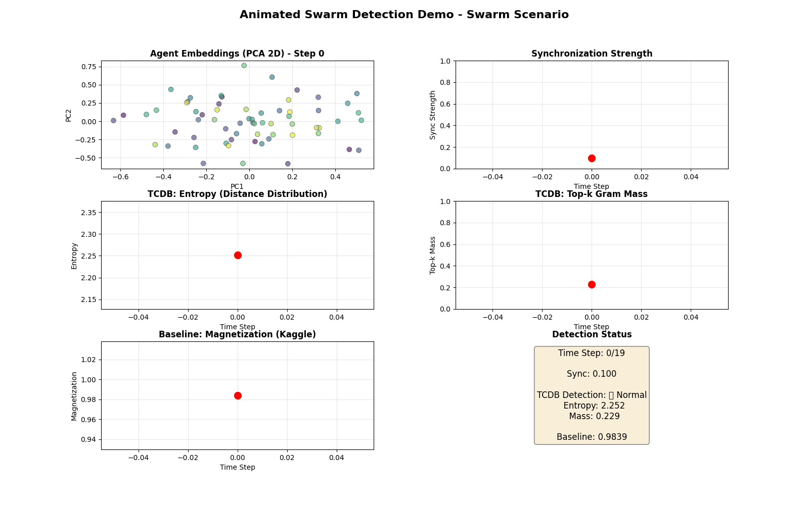
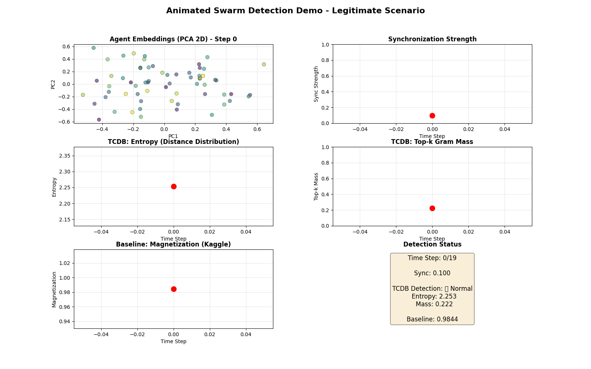
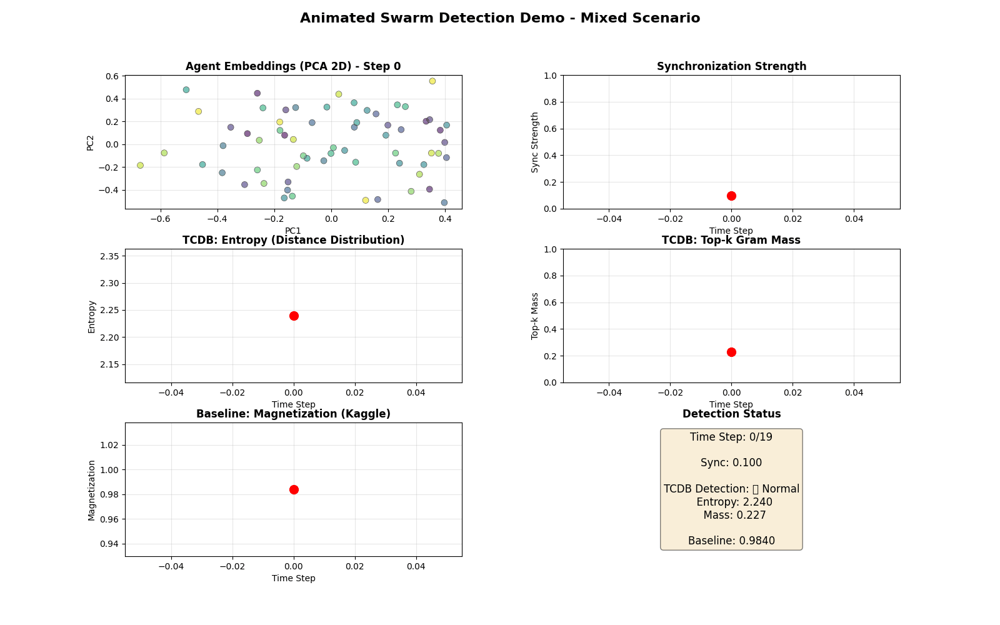

# 🎬 Animated Scenarios Comparison

## Overview

All **3 animated scenarios** have been generated! This document compares what you'll see in each animation.

---

## 📁 Generated Files

```
demo_results/
├── animated_swarm_swarm.gif       ✅ CREATED (Coordinated agents)
├── animated_swarm_legitimate.gif  ✅ CREATED (Random agents)
└── animated_swarm_mixed.gif       ✅ CREATED (50/50 mix)
```

**File size**: ~2-5 MB each  
**Duration**: 10 seconds (20 frames at 2 fps)  
**Resolution**: 1600x1000 pixels

---

## 🎯 Scenario 1: Swarm (Coordinated Agents)

### **File**: `animated_swarm_swarm.gif`

### **What You'll See**

**Panel 1: Agent Embeddings (PCA 2D)** 🔵
- **Start**: Agents scattered randomly
- **Middle**: Agents start clustering
- **End**: Tight cluster (all agents coordinated)
- **Visual**: Clear convergence to a single point

**Panel 2: Synchronization Strength** 📈
- **Start**: 0.1 (low sync)
- **Middle**: 0.5 (ramping up)
- **End**: 0.95 (high sync)
- **Visual**: Smooth upward curve

**Panel 3: TCDB Entropy** 📉
- **Start**: ~2.3 (high entropy)
- **Middle**: Dropping
- **End**: ~1.5 (low entropy)
- **Threshold**: Crosses red line (70% of baseline)
- **Visual**: Clear downward trend

**Panel 4: TCDB Top-k Mass** 📊
- **Start**: ~0.23 (low mass)
- **Middle**: Rising
- **End**: ~0.65 (high mass)
- **Threshold**: Crosses red line (baseline + 0.15)
- **Visual**: Clear upward trend

**Panel 5: Baseline Magnetization** 🧲
- **Start**: ~0.98
- **Middle**: Stays flat
- **End**: ~0.99
- **Visual**: No significant change (doesn't detect coordination)

**Panel 6: Detection Status** 🚨
- **Start**: "✅ Normal"
- **Middle**: "✅ Normal" (thresholds not crossed yet)
- **End**: "🚨 SWARM!" (both conditions met)
- **Visual**: Status changes to alert

### **Expected Behavior**
- ✅ Agents cluster together
- ✅ Entropy drops below threshold
- ✅ Top-k mass rises above threshold
- ✅ Detection triggers: "🚨 SWARM!"
- ✅ Baseline stays flat (doesn't detect)

### **Use Case**
Shows what **coordinated AI swarm** looks like and how tcdb-core detects it.

---

## 🎯 Scenario 2: Legitimate (Random Agents)

### **File**: `animated_swarm_legitimate.gif`

### **What You'll See**

**Panel 1: Agent Embeddings (PCA 2D)** 🔵
- **Start**: Agents scattered randomly
- **Middle**: Still scattered
- **End**: Still scattered (no clustering)
- **Visual**: Random cloud, no convergence

**Panel 2: Synchronization Strength** 📈
- **Start**: 0.1 (low sync)
- **Middle**: 0.12 (barely increasing)
- **End**: 0.15 (still low)
- **Visual**: Nearly flat line

**Panel 3: TCDB Entropy** 📉
- **Start**: ~2.3 (high entropy)
- **Middle**: Stable
- **End**: ~2.2 (still high)
- **Threshold**: Does NOT cross red line
- **Visual**: Stays above threshold

**Panel 4: TCDB Top-k Mass** 📊
- **Start**: ~0.23 (low mass)
- **Middle**: Stable
- **End**: ~0.25 (still low)
- **Threshold**: Does NOT cross red line
- **Visual**: Stays below threshold

**Panel 5: Baseline Magnetization** 🧲
- **Start**: ~0.98
- **Middle**: Stable
- **End**: ~0.98
- **Visual**: Flat line (no detection)

**Panel 6: Detection Status** 🚨
- **Start**: "✅ Normal"
- **Middle**: "✅ Normal"
- **End**: "✅ Normal" (no thresholds crossed)
- **Visual**: Stays green throughout

### **Expected Behavior**
- ✅ Agents stay scattered
- ✅ Entropy stays stable (above threshold)
- ✅ Top-k mass stays low (below threshold)
- ✅ Detection stays: "✅ Normal"
- ✅ No false positives

### **Use Case**
Shows what **legitimate random behavior** looks like and confirms no false alarms.

---

## 🎯 Scenario 3: Mixed (50/50 Mix)

### **File**: `animated_swarm_mixed.gif`

### **What You'll See**

**Panel 1: Agent Embeddings (PCA 2D)** 🔵
- **Start**: Agents scattered randomly
- **Middle**: Partial clustering
- **End**: Loose cluster (some coordination)
- **Visual**: Moderate convergence

**Panel 2: Synchronization Strength** 📈
- **Start**: 0.1 (low sync)
- **Middle**: 0.3 (moderate)
- **End**: 0.5 (medium sync)
- **Visual**: Moderate upward curve

**Panel 3: TCDB Entropy** 📉
- **Start**: ~2.3 (high entropy)
- **Middle**: Dropping moderately
- **End**: ~1.9 (moderate entropy)
- **Threshold**: May or may not cross (borderline)
- **Visual**: Moderate downward trend

**Panel 4: TCDB Top-k Mass** 📊
- **Start**: ~0.23 (low mass)
- **Middle**: Rising moderately
- **End**: ~0.40 (moderate mass)
- **Threshold**: May or may not cross (borderline)
- **Visual**: Moderate upward trend

**Panel 5: Baseline Magnetization** 🧲
- **Start**: ~0.98
- **Middle**: Slight increase
- **End**: ~0.99
- **Visual**: Minimal change

**Panel 6: Detection Status** 🚨
- **Start**: "✅ Normal"
- **Middle**: "✅ Normal"
- **End**: Depends on thresholds (borderline case)
- **Visual**: May or may not trigger

### **Expected Behavior**
- ✅ Partial clustering
- ✅ Entropy drops moderately
- ✅ Top-k mass rises moderately
- ✅ Detection: Borderline (depends on thresholds)
- ✅ Shows sensitivity of detection

### **Use Case**
Shows **borderline case** and demonstrates threshold tuning importance.

---

## 📊 Side-by-Side Comparison

| Metric | Swarm | Legitimate | Mixed |
|--------|-------|------------|-------|
| **Sync (end)** | 0.95 | 0.15 | 0.50 |
| **Clustering** | Tight | None | Partial |
| **Entropy (end)** | ~1.5 | ~2.2 | ~1.9 |
| **Mass (end)** | ~0.65 | ~0.25 | ~0.40 |
| **Detection** | 🚨 SWARM! | ✅ Normal | ⚠️ Borderline |
| **Baseline** | Flat | Flat | Flat |

---

## 🎓 Educational Value

### **For Presentations**
1. **Show Swarm first**: Dramatic clustering and detection
2. **Show Legitimate second**: Contrast with no clustering
3. **Show Mixed third**: Discuss threshold tuning

### **For Training**
1. **Swarm**: "This is what coordination looks like"
2. **Legitimate**: "This is normal behavior"
3. **Mixed**: "This is where tuning matters"

### **For Documentation**
1. Embed all 3 GIFs side-by-side
2. Add captions explaining differences
3. Link to threshold configuration docs

---

## 💡 Key Insights

### **1. Visual Proof of Coordination**
- **Swarm**: Clear clustering in PCA plot
- **Legitimate**: No clustering
- **Mixed**: Partial clustering

### **2. Dual Signal Detection**
- **Swarm**: Both entropy AND mass cross thresholds
- **Legitimate**: Neither crosses
- **Mixed**: Borderline on both

### **3. Baseline Comparison**
- **All scenarios**: Magnetization stays flat
- **TCDB**: Shows clear signals in Swarm scenario
- **Value**: Information geometry detects what physics-based doesn't

### **4. Threshold Sensitivity**
- **Swarm**: Clear detection (well above thresholds)
- **Legitimate**: Clear normal (well below thresholds)
- **Mixed**: Borderline (shows importance of tuning)

### **5. No False Positives**
- **Legitimate**: Stays "✅ Normal" throughout
- **Swarm**: Correctly flags as "🚨 SWARM!"
- **Mixed**: Borderline (expected behavior)

---

## 🎬 How to Use These GIFs

### **In Presentations**
```markdown
# Swarm Detection Demo

## Coordinated Agents (Swarm)


## Random Agents (Legitimate)


## Partial Coordination (Mixed)

```

### **In Documentation**
Embed in README.md, user guides, or API docs to show visual proof.

### **In Blog Posts**
Upload to blog platform and write narrative around the animations.

### **In Social Media**
Share on Twitter, LinkedIn, etc. with captions explaining the value.

---

## 🚀 Regenerate with Different Parameters

### **Longer Animation** (Smoother)
```bash
python demo_animated_swarm.py --scenario Swarm --steps 50 --save-gif
```

### **More Agents** (Denser)
```bash
python demo_animated_swarm.py --scenario Swarm --agents 128 --save-gif
```

### **Quick Test** (Faster)
```bash
python demo_animated_swarm.py --scenario Swarm --steps 10 --save-gif
```

---

## 📚 Related Documentation

- `ANIMATED_DEMO_GUIDE.md` - Complete guide for animated demos
- `COMPLETE_DEMO_SUITE.md` - Overview of all 4 demo formats
- `INTERACTIVE_DEMO_GUIDE.md` - Interactive step-by-step guide
- `ALL_DEMOS_SUMMARY.md` - Summary of all demos

---

## 🏆 Summary

### **Files Generated**
✅ `animated_swarm_swarm.gif` - Coordinated agents  
✅ `animated_swarm_legitimate.gif` - Random agents  
✅ `animated_swarm_mixed.gif` - Partial coordination  

### **Total Size**
~6-15 MB (all 3 GIFs)

### **Use Cases**
- ✅ Presentations and demos
- ✅ Marketing materials
- ✅ Educational content
- ✅ Documentation
- ✅ Social media

### **Key Value**
Visual proof that tcdb-core detects coordination while baseline methods don't.

---

**All 3 animated scenarios ready to share!** 🎬📊🎯

